## Team Name

>Budget Bandits

## Website/App Name

>Wallet Warrior - https://team3-january-hackathon.onrender.com/

## Contents

- [Team Name](#team-name)
- [Website/App Name](#websiteapp-name)
- [Contents](#contents)
  - [First-Time User Goals](#first-time-user-goals)
  - [Returning User Goals](#returning-user-goals)
  - [Technology:](#technology)
    - [Languages](#languages)
    - [Frameworks](#frameworks)
    - [Other tools](#other-tools)
  - [Initial MVP idea:](#initial-mvp-idea)
  - [3 pages:](#3-pages)
  - [Features](#features)
    - [Actual idea \& content:](#actual-idea--content)
  - [Design](#design)
    - [Color Scheme:](#color-scheme)
    - [Typography:](#typography)
    - [Imagery:](#imagery)
  - [Wireframes:](#wireframes)
    - [Mobile Wireframes:](#mobile-wireframes)
    - [Desktop Wireframes:](#desktop-wireframes)
  - [Deployment](#deployment)
      - [How to Fork](#how-to-fork)
      - [How to Clone](#how-to-clone)
      - [Features](#features)
  - [Testing](#testing)
  - [Credits](#credits)
    - [Code](#code)
    - [Content](#content)
    - [Media](#media)
    - [Acknowledgements](#acknowledgements)
## First-Time User Goals

>* Sign up and create an account for the app
>* I would like to be able to track my spending.
>* Be able to track my savings and set a target.
>* Set my own financial goals for e.g holiday or car.
>* Convert my currency into another currency.
>* Monitor the weather forecast in other countries.
​
## Returning User Goals

>* Log into my account to monitor my progress.
>* Review my spending to identify what areas to cut back on.
>* Add new spend items to keep up to date with my spending.
>* Check how far I am from reaching my goal.
>* Set new financial goals and continue to work towards them.
>* Convert my currency into another currency.
>* Monitor the weather forecast for a certain country.

​
## Technology:
​​​
###  Languages
>* HTML
>* CSS
>* Python
​
### Frameworks

>* Django
>* Bulma CSS

### Other tools

>* Git
>* API Layer: Exchange Rates Data API

​
## Initial MVP Idea:

>A Django app which will help a user to save the money for their set goals and it will include:

##  3 pages:

>1. Landing page explaining explaining what the purpose of the page is and log in sign up option in the header
>2. Cashbook page where the user can add and track their spend based on categories 
>3. Set-goal page where the user can set their own financial goals (e.g saving for a holiday, a car )

##  Features:

>* log in/sign in option
>* selection of categories to enter the spend (e.g. groceries, socialising, bills)
>* add-button to add new spend 
>* display showing % of the goal reached 
>* card with the goal description and the desired saving amount 
>* add-button for new goals
>* conversion of the desired amount in the selected currency (API)
>* drop-down with the conversion options
>* display of weather forecast in the destination of choisce (API)

​
### Actual idea & content:
​
Our MVP was an app to track expenses and goals.
- Cashbook:
  - People are able to log their expenses and select a category. Having this overview they can have a better understanding of where they money is going.
- Goals:
  - On goals people can create a goal and if they are in a diferent currency they can convert the ammount needed to and know how much they would spend on their own currency.

What is missing from our main idea is to have the ability to add money to the goals. That way the user would be able to know how close they are to reach their goals.
​
## Design

### Logo

>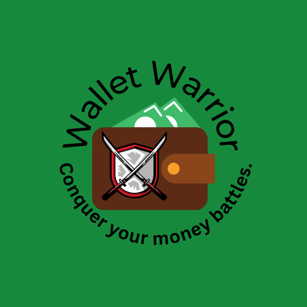

​
### Color Scheme:
>* Brown Derby #462414
>* Soft Amber #D3C0B7
>* Ocean Green #4EBA76
>* Gray #929292
>* Calico #DDAC90

​
### Imagery:
>
>
>
>
​
## Wireframes:

### Mobile Wireframes:
​​​
>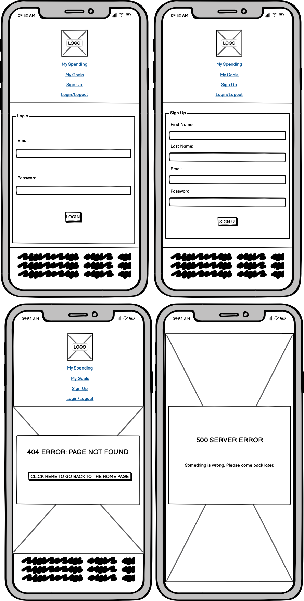
>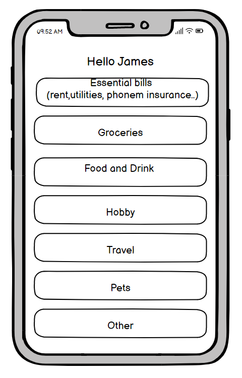
>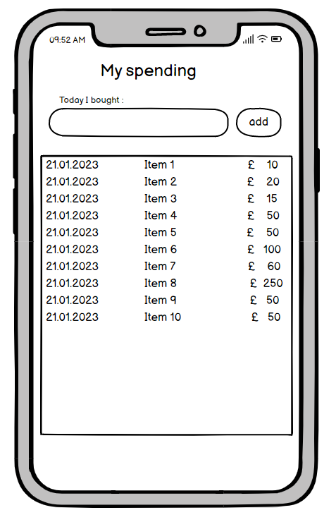
>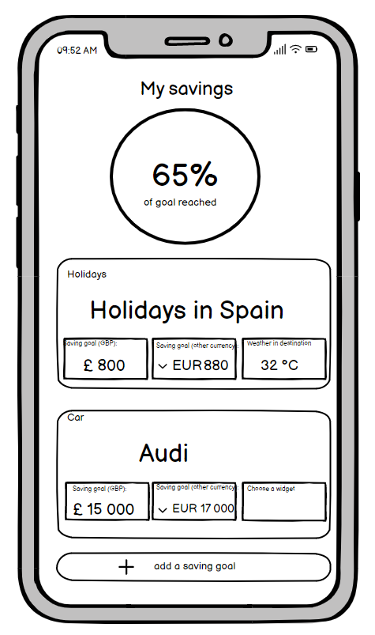

### Desktop Wireframes:

>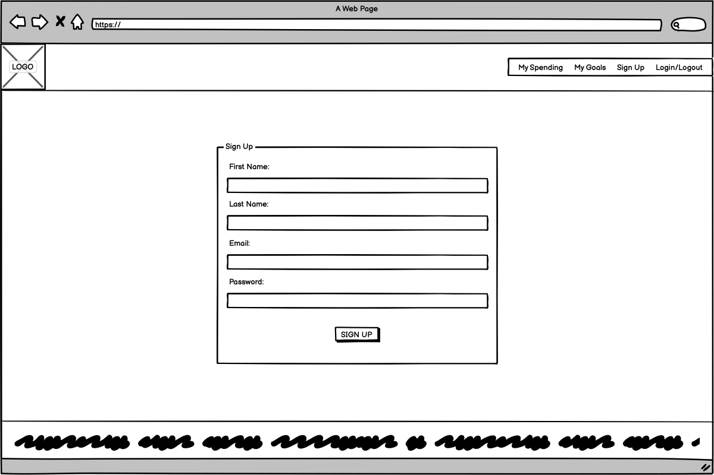
>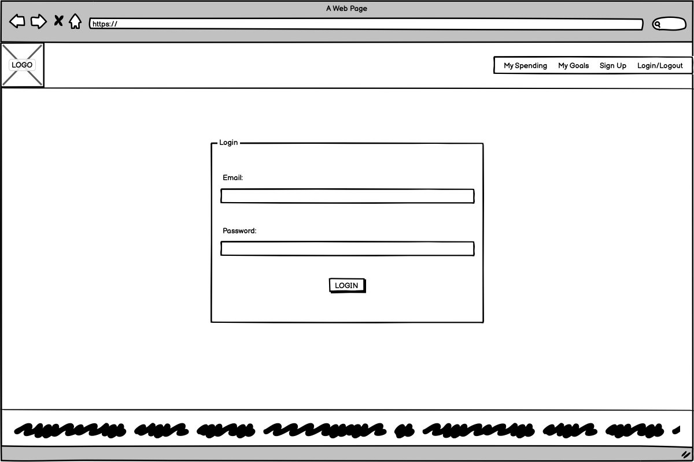
>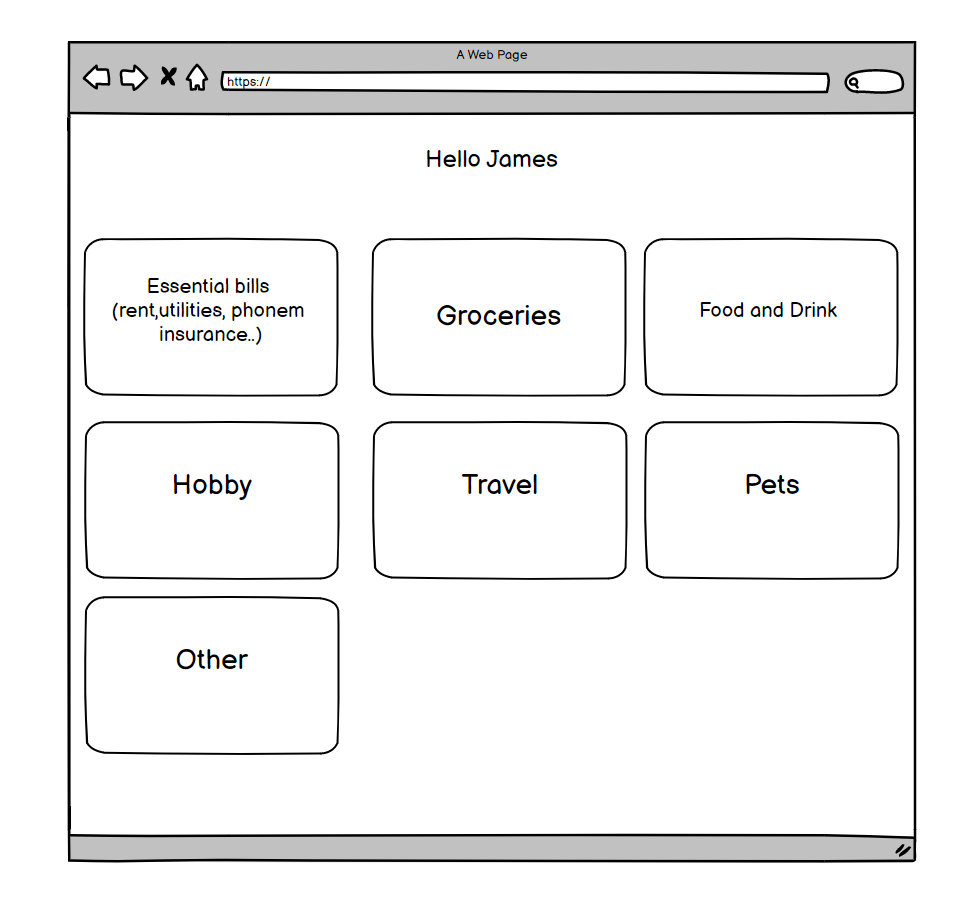
>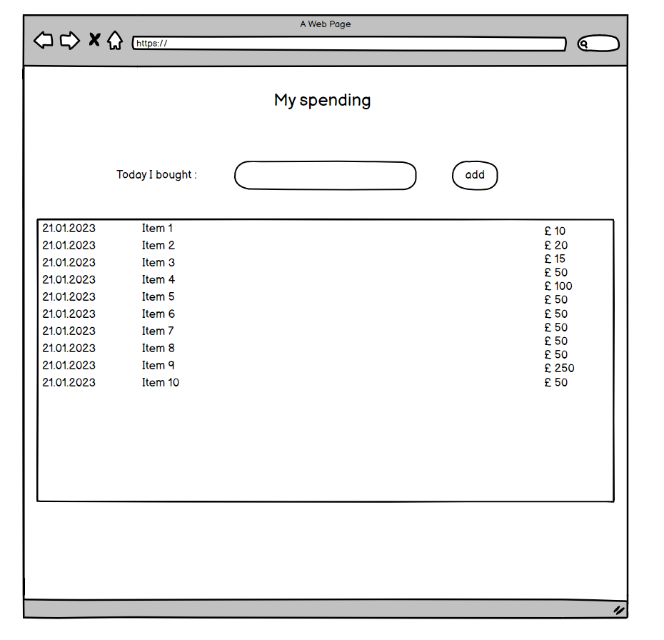
>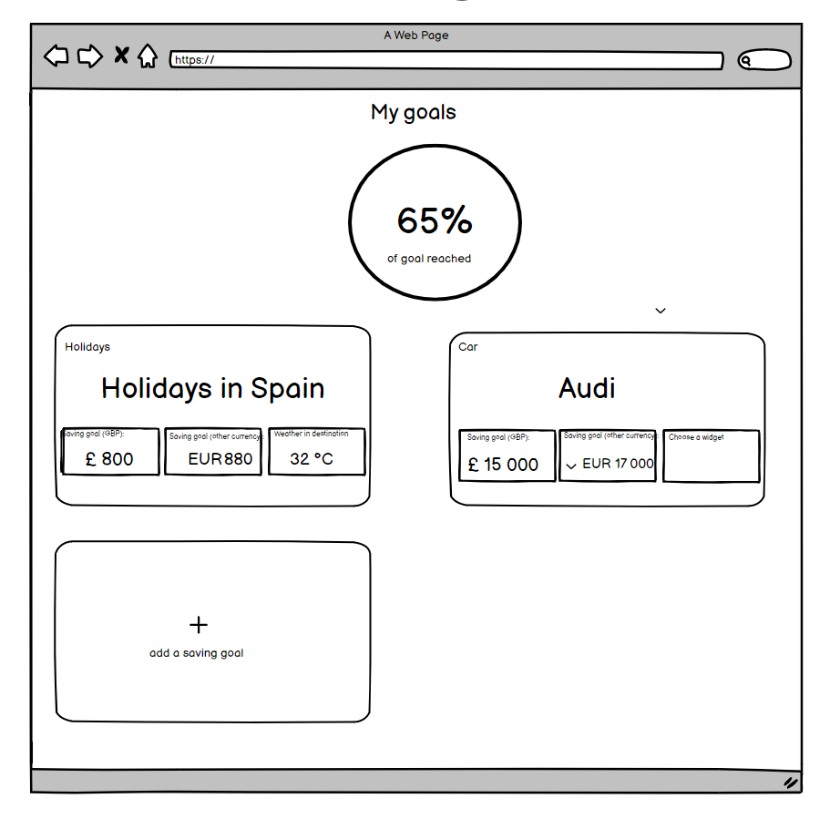
>
>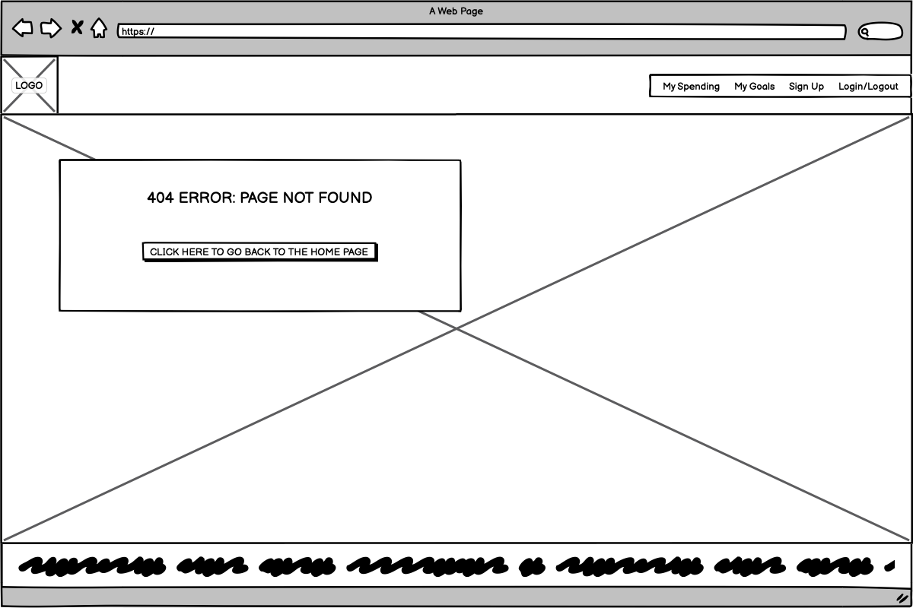
>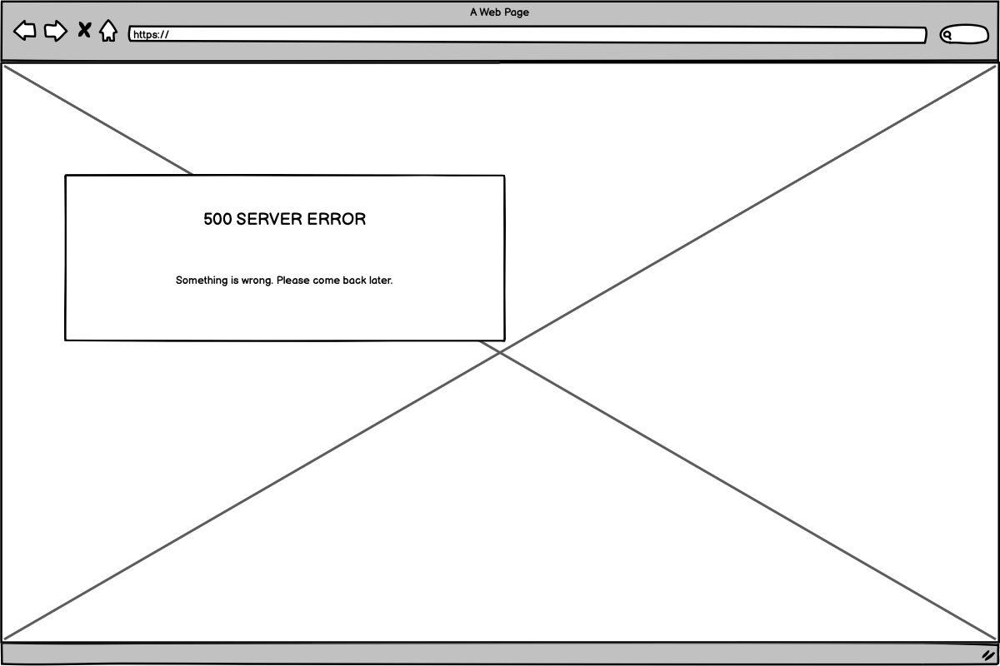

## Deployment

#### How to Fork

>To fork the repository:
>1. Log in (or sign up) to Github.
>2. Go to the repository for this project, [Team3](https://github.com/StephenB92/team3-january-hackathon).
>3. Click the Fork button in the top right corner.

#### How to Clone

>To clone the repository:
>1. Log in (or sign up) to GitHub.
>2. Go to the repository for this project, [Team3](https://github.com/StephenB92/team3-january-hackathon).
>3. Click on the code button, select whether you would like to clone with HTTPS, SSH or GitHub CLI and copy the link shown.
>4. Open the terminal in your code editor and change the current working directory to the location you want to use for the cloned directory.
>5. Type 'git clone' into the terminal and then paste the link you copied in step 3. Press enter.

## Testing

>* I had no problem launching the website.
>* I clicked the Facebook link in the footer and it took me to Facebook.
>* I clicked the Instagram link in the footer and it took me to Instagram.
>* I clicked the Twitter link in the footer and it took me to Twitter.
>* I clicked the Youtube link in the footer and it took me to Youtube.
>* I clicked the white Sign Up button on the top right hand side and the sign up page loaded.
>* I was able to enter my email address, username, password and password again.
>* I clicked the green Sign Up button and it took me to the verify email page.
>* I clicked the Wallet Warriors logo on the top left hand side and it took me back to the landing page.
>* I clicked the green Log In button on the top right hand side and it took me to the log in page.

#### Known Bugs
>* In the initial model created for the Cashbook app, the unique indentifier was set as a slug which was derived from the Cashbook title. This caused an issue as there could only be one existing Cashbook called "Monday shop" for example. Obviously this isn't sustainable so the model was amended so the unique identifier would be derived from the date the Cashbook was created. This resolved the issue insofar as user's could have multiple Cashbooks with the same name and yet still leave them with a unique identifier. However, an issue would only arise if 2 users created a Cashbook at the exact same time. This is highly unlikely to happen but can still be categorised as a known bug.

>* Goals is currently not filtering by users.

## Credits

### Code
>* We are using API Layer: Exchange Rates Data API

### Media

- Logo was created using Canva
- The other images were found on Pexels
  - [Main image](https://www.pexels.com/photo/cutout-paper-composition-with-graphic-and-hand-with-bills-5849592/)
  - [404 Page](https://www.pexels.com/photo/a-person-looking-the-wallet-8719570/)
  - [500 Page](https://www.pexels.com/photo/bills-capital-cash-cent-210679/)
  - [403 Page](https://www.pexels.com/photo/hard-cash-on-a-briefcase-259027/)

### Acknowledgements

>* [Stephen Brereton](https://github.com/StephenB92)
>* [Nik](https://github.com/Niki-Tester)
>* [Veronika](https://github.com/vero-nika-2828)
>* [Tanise Carvalho](https://github.com/tanisecarvalho)
>* [Samuel Naiwo](https://github.com/SamuelNaiwo)
>* [Tinashe](https://github.com/chasakara)