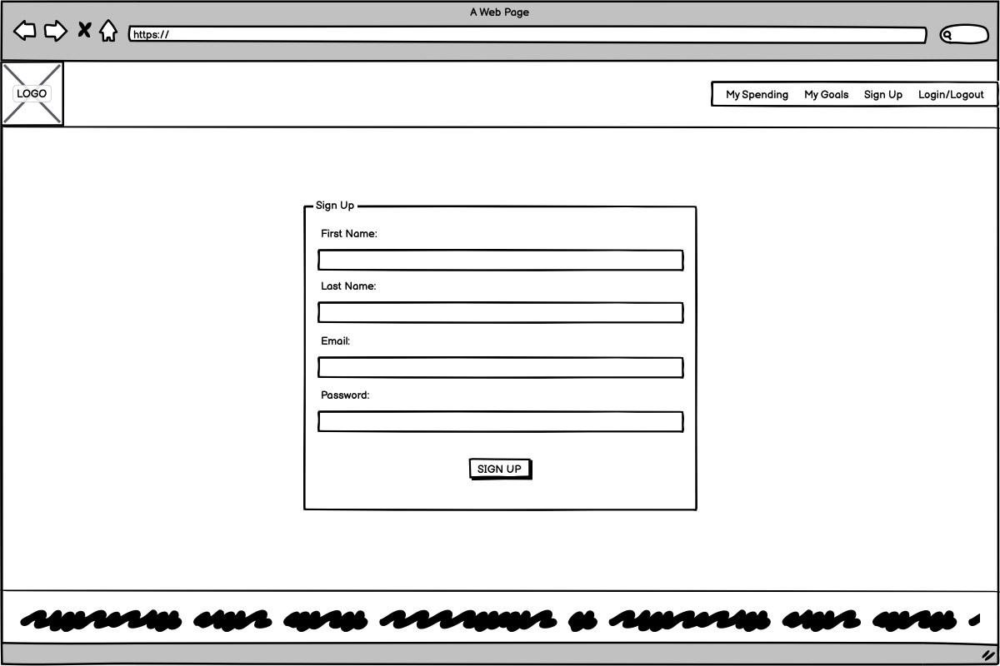

## Team Name

>Budget Bandits

## Website/App Name

>Wallet Warrior

## Contents(#contents)
- [Team Name](#team-name)
- [Website/App Name](#websiteapp-name)
- [Contents(#contents)](#contentscontents)
  - [First-Time User Goals](#first-time-user-goals)
  - [Returning User Goals](#returning-user-goals)
  - [Technology:](#technology)
    - [Languages](#languages)
    - [Frameworks](#frameworks)
    - [Other tools](#other-tools)
  - [Initial MVP idea:](#initial-mvp-idea)
  - [3 pages:](#3-pages)
  - [Features](#features)
    - [Actual idea \& content:](#actual-idea--content)
  - [Design](#design)
    - [Color Scheme:](#color-scheme)
    - [Typography:](#typography)
    - [Imagery:](#imagery)
  - [Wireframes:](#wireframes)
    - [Mobile Wireframes:](#mobile-wireframes)
    - [Desktop Wireframes:](#desktop-wireframes)
  - [Deployment](#deployment)
      - [How to Fork](#how-to-fork)
      - [How to Clone](#how-to-clone)
  - [Testing](#testing)
  - [Credits](#credits)
    - [Code](#code)
    - [Content](#content)
    - [Media](#media)
    - [Acknowledgements](#acknowledgements)
## First-Time User Goals

>* Sign up and create an account for the app
>* I would like to be able to track my spending.
>* Be able to track my savings and set a target.
>* Set my own financial goals for e.g holiday or car.
>* Convert my currency into another currency.
>* Monitor the weather forecast in other countries.
​
## Returning User Goals

>* Log into my account to monitor my progress.
>* Review my spending to identify what areas to cut back on.
>* Add new spend items to keep up to date with my spending.
>* Check how far I am from reaching my goal.
>* Set new financial goals and continue to work towards them.
>* Convert my currency into another currency.
>* Monitor the weather forecast for a certain country.

​
## Technology:
​​​
###  Languages
>* HTML
>* CSS
>* Python
​
### Frameworks

>* Django

### Other tools

>* Git

​
## Initial MVP Idea:

>A Django app which will help a user to save the money for their set goals and it will include:

##  3 pages:

>1. Landing page explaining explaining what the purpose of the page is and log in sign up option in the header
>2. Cashbook page where the user can add and track their spend based on categories 
>3. Set-goal page where the user can set their own financial goals (e.g saving for a holiday, a car )

##  Features:

>* log in/sign in option
>* selection of categories to enter the spend (e.g. groceries, socialising, bills)
>* add-button to add new spend 
>* display showing % of the goal reached 
>* card with the goal description and the desired saving amount 
>* add-button for new goals
>* conversion of the desired amount in the selected currency (API)
>* drop-down with the conversion options
>* display of weather forecast in the destination of choisce (API)

​
### Actual idea & content:
​
<< how does you final product/project match up to your initial mvp plans >>
​
<< detail idea / features / functionality here >>
​
## Design
​
### Color Scheme:
<< detail your color palette here >>
​
### Typography:
<< what font pairings did your team consider and pick? And why? >>
​
### Imagery:
<< Detail imagery used to compliment your build & theme >>
​
<< ensure source attribution is maintained, and that you have used copyright free material >>
​
## Wireframes:

### Mobile Wireframes:
​​​
>

### Desktop Wireframes:

>

## Deployment

#### How to Fork

>To fork the repository:
>1. Log in (or sign up) to Github.
>2. Go to the repository for this project, [Team3](https://github.com/StephenB92/team3-january-hackathon).
>3. Click the Fork button in the top right corner.

#### How to Clone

>To clone the repository:
>1. Log in (or sign up) to GitHub.
>2. Go to the repository for this project, [Team3](https://github.com/StephenB92/team3-january-hackathon).
>3. Click on the code button, select whether you would like to clone with HTTPS, SSH or GitHub CLI and copy the link shown.
>4. Open the terminal in your code editor and change the current working directory to the location you want to use for the cloned directory.
>5. Type 'git clone' into the terminal and then paste the link you copied in step 3. Press enter.

​
## Testing
<< detail testing logs here - any known bugs, and squashed bugs 🐛🐛 >>
​
## Credits
​
### Code
<< any and all code that isn't yours...must go here >>
​
### Content
<< any content, such as facts/references/text that isn't yours...must go here >>
​
### Media
<< you may have already done this above in the Imagery section, but just in case, please attribute Media acquisition here >>
​
### Acknowledgements
<< personal thanks and praise 🙌 >>

[Stephen Brereton](https://github.com/StephenB92)

